> **Moosh is an unofficial modified version of AltTab.** It keeps the full feature set available without a paid tier, uses the bundle identifier `com.tyrival.moosh`, and publishes updates independently. AltTab and its original authors do not provide support for this fork. This project remains available under GPL-3.0.

